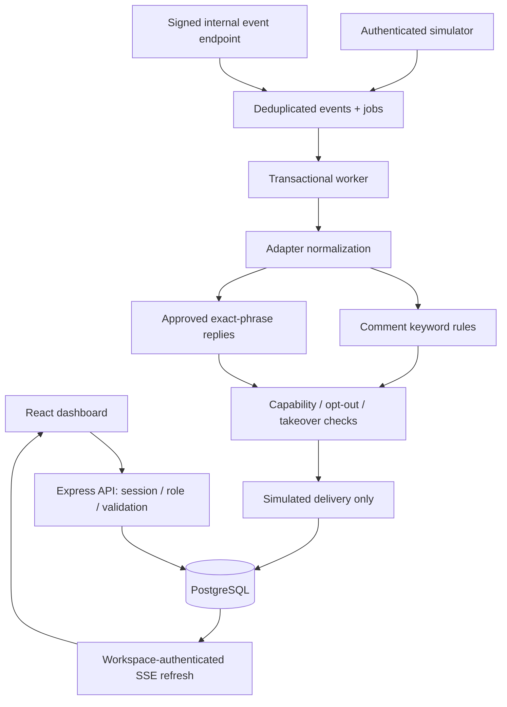

# Architecture

The browser never owns business records. Only theme preferences are device-local. API requests use an HTTP-only opaque session, membership lookup, tenant-local IDs, and CSRF headers. SQL parameters prevent injection; React escapes text.

PGlite enables a no-service local development experience using the same SQL as PostgreSQL. Production requires PostgreSQL. Entity documents are JSONB rows in a common workspace-owned record table; this is an intentionally compact MVP schema rather than claiming a fully normalized 30-table CRM. Users, workspaces, memberships, sessions, events, jobs and deliveries are separate relational tables.

Events are uniquely keyed by workspace/account/platform-event ID. Ingest commits the event and job atomically. A worker selects a pending job with FOR UPDATE SKIP LOCKED. Workspace row locking serializes rule execution against takeover and relevant edits. Savepoints ensure retries do not retain partial work. Five failed attempts produce a dead letter.

SSE sends a refresh signal every five seconds. It does not deliver private records in the event stream; subsequent API reads are reauthorized. Streams expire after one minute so reconnect rechecks the session. This is near-real-time refresh, not provider webhook monitoring.

Real HTTP sends cannot be undone with a SQL transaction. Before enabling a live adapter, implement a transactional outbox with stable action IDs, provider deduplication where supported, reconciliation for unknown delivery outcomes, account rate limits and messaging-window checks. Never reuse the demo transaction as a live send queue.
